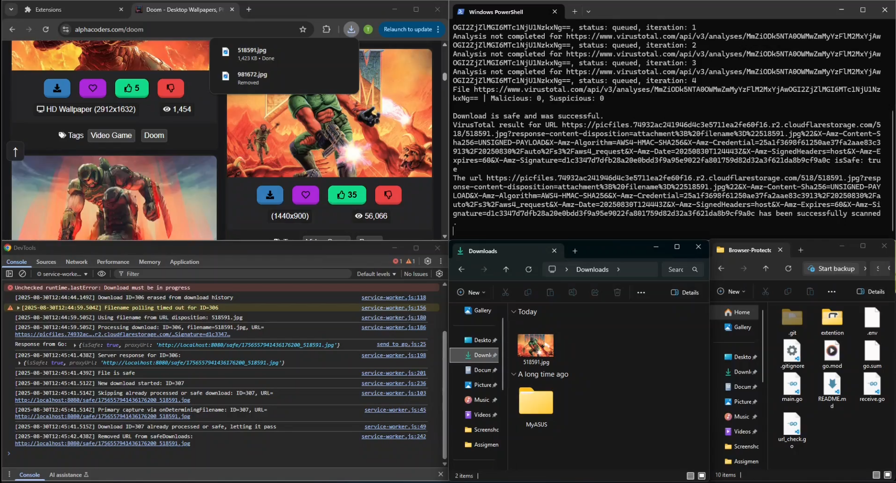

# chrome-donwload-scanner 

>A Go backend + Chrome extension that ensures files are only downloaded **after being scanned by VirusTotal**.



## Features
- Cancels the **original browser download** and instead saves the file into a temp folder for scanning - improving security by ensuring files never reach the user unverified.  
- Works through a **simple POST endpoint** (`/submit-data`) with JSON `{ id, url, filename, mime }`.  
- **Archive support**: detects `zip`, `rar`, `tar`, `7z`, extracts them, and scans each contained file.  
- **Smart filename resolution**: prefers `Content-Disposition` headers (including `filename*` RFC 5987), falls back to URL or MIME type.  
- **VirusTotal integration**: scans files ≤25 MB, respects API rate limits (1 request/15 s), polls until analysis finishes or times out.  
- **One-time safe link**: returns a temporary `/safe/{token}` URL if the file is clean. Link works only once.  
- **Automatic cleanup**: deletes temp files/folders after serving.  

## Overview

1. The Chrome extension **intercepts the download**, cancels it in the browser, and sends the file information (`id, url, filename, mime`) to the Go backend.  
2. The backend downloads the file into `./temp/uncompressed` (or `./temp/compressed` if archive).  
3. If the file is an archive, it’s extracted into `./temp/uncompressed` and the contained files are scanned.  
4. Each file is uploaded to VirusTotal. The server polls until the analysis is `completed` or a timeout is hit. 
5. If **any** file is flagged , no download link is given.  
   If **all** are clean , the original file is exposed via a one-time `/safe/{token}` URL **and then downloaded by the browser**.  
6. Once `/safe/{token}` is fetched, the file is served once and then deleted from temp.  
7. `temp` directory is deleted at the end of each scan.

**Temp layout**
```
./temp/
  ├─ compressed/     # original archives
  └─ uncompressed/   # original non-archives & extracted contents
```

## Usage
### Dependencies
This project uses the following Go modules:  

- [`github.com/gen2brain/go-unarr`](https://github.com/gen2brain/go-unarr) – for extracting archives (`zip`, `rar`, `tar`, `7z`).  
- [`github.com/joho/godotenv`](https://github.com/joho/godotenv) – for loading the API key from a `.env` file.  

### Prerequisites
- Go (1.20+ recommended)
- A VirusTotal API key in a local `.env` file:
```
API_KEY=YOUR_VIRUSTOTAL_API_KEY
```
- Outbound internet access to VirusTotal.

### Run
```bash
go run .
# Server listens on :8080
```

Then, make sure the Chrome extension is running. The extension intercepts downloads, cancels the browser’s default behavior, and instead forwards the URL to the backend for scanning.  


